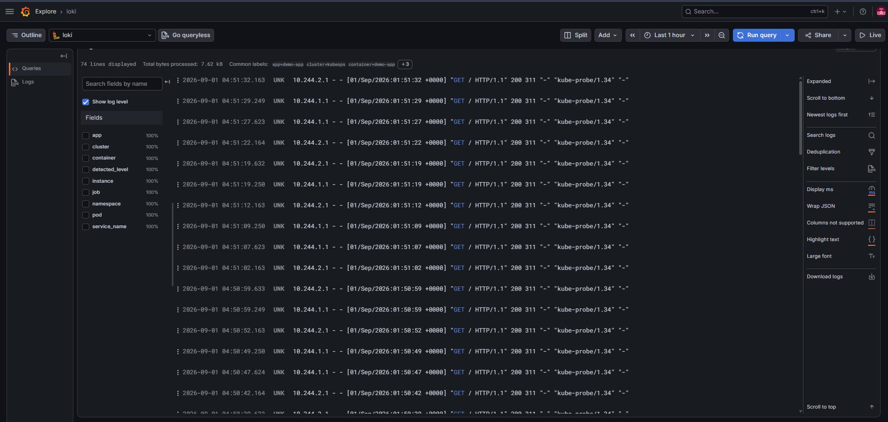
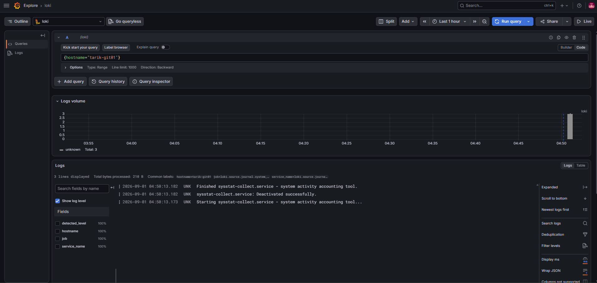

# End-to-End DevOps Infrastructure & GitOps Platform

A hands-on DevOps environment built on **Nutanix AHV-based private cloud infrastructure** to design and operate a complete software delivery and observability workflow.

The environment integrates infrastructure automation, CI, container image management, Kubernetes, GitOps-based deployment, metrics, alerting, and centralized logging.

The goal of this project is not to demonstrate individual tools in isolation, but to integrate them into a working end-to-end platform.

---

## Architecture

```text
                              GitHub
                                 │
                                 ▼
                              Jenkins
                                 │
                         Build Docker Image
                                 │
                                 ▼
                               Harbor
                         Private Registry
                                 │
                                 │
                    Update Kubernetes Manifest
                                 │
                                 ▼
                              GitHub
                                 │
                                 ▼
                              Argo CD
                                 │
                                 ▼
                         Kubernetes Cluster
                      ┌──────────┴──────────┐
                      │                     │
                 Control Plane          Workers
                                      demo-app
                                          │
                                          ▼
                                       Service


                       OBSERVABILITY

              ┌──────────── Metrics ─────────────┐
              │                                  │
        Node Exporter                   kube-state-metrics
              │                                  │
              └──────────► Prometheus ◄──────────┘
                               │
                               ▼
                            Grafana

                         Alert Rules
                               │
                               ▼
                         Alertmanager


                 CENTRALIZED LOGGING

        Linux Servers                Kubernetes Pods
             │                             │
             ▼                             ▼
        Grafana Alloy                 Grafana Alloy
             │                             │
             └──────────────┬──────────────┘
                            ▼
                           Loki
                            │
                            ▼
                         Grafana
```

---

## Infrastructure

The environment runs on Ubuntu Server virtual machines hosted on Nutanix AHV.

| Host | IP Address | Role |
|---|---|---|
| `tarik-ci01` | `192.168.5.1` | Jenkins CI/CD |
| `tarik-git01` | `192.168.5.2` | Git services |
| `tarik-k8s-cp01` | `192.168.5.3` | Kubernetes control plane |
| `tarik-k8s-wrk01` | `192.168.5.4` | Kubernetes worker |
| `tarik-k8s-wrk02` | `192.168.5.5` | Kubernetes worker |
| `tarik-monitor01` | `192.168.5.6` | Prometheus, Grafana, Alertmanager |
| `tarik-ops01` | `192.168.5.7` | Ansible control node |
| `tarik-reg01` | `192.168.5.8` | Harbor container registry |
| `tarik-log01` | `192.168.5.9` | Loki centralized logging |

---

## CI/CD and GitOps

Application delivery follows a GitOps workflow.

```text
Developer
   │
   ▼
GitHub
   │
   ▼
Jenkins
   │
   ├── Validate automation
   ├── Build Docker image
   ├── Authenticate to Harbor
   ├── Push versioned image
   └── Update Kubernetes image tag in Git
             │
             ▼
           GitHub
             │
             ▼
           Argo CD
             │
             ▼
         Kubernetes
```

Jenkins is responsible for the CI portion of the workflow.

When a code change is detected, Jenkins builds a new Docker image and pushes both versioned and latest tags to the private Harbor registry.

The pipeline then updates the image version in the Kubernetes deployment manifest and pushes the desired state back to Git.

Argo CD monitors the Git repository and synchronizes the Kubernetes cluster with the desired state stored in Git.

This keeps deployment responsibility outside Jenkins and makes Git the source of truth for the cluster state.

### Jenkins Pipeline


---

## Private Container Registry

Harbor is used as the internal container image registry.

Application images produced by Jenkins are stored as versioned artifacts before being pulled by Kubernetes.

```text
Jenkins
   │
   ▼
harbor.kubeops.local
   │
   ├── demo-app:<build-number>
   └── demo-app:latest
         │
         ▼
     Kubernetes
```

Jenkins authenticates to Harbor using a dedicated robot account rather than a personal user account.

### Harbor Registry


---

## Kubernetes

The Kubernetes environment consists of one control-plane node and two worker nodes.

The sample application runs with multiple replicas and is exposed through a Kubernetes Service.

The application deployment includes:

- Multiple pod replicas
- Readiness probes
- Liveness probes
- Versioned container images
- Private Harbor image pulls
- GitOps-based deployment through Argo CD

The container runtime is **containerd**.

---

## Infrastructure Automation

Ansible is used from the dedicated operations node to configure and maintain the Linux infrastructure.

Automation covers tasks such as:

- Base server configuration
- Package installation
- Common system configuration
- Node Exporter deployment
- Jenkins setup
- Harbor setup
- Kubernetes configuration
- Monitoring configuration
- Prometheus targets
- Alertmanager
- Loki
- Grafana Alloy

Current playbooks include:

```text
ansible/playbooks/
├── base-setup.yml
├── ci-setup.yml
├── registry-setup.yml
├── harbor-setup.yml
├── kubernetes-setup.yml
├── kubernetes-cluster.yml
├── kubernetes-harbor.yml
├── monitoring-setup.yml
├── node-exporter.yml
├── prometheus-targets.yml
├── alertmanager-setup.yml
├── prometheus-alerts.yml
├── loki-setup.yml
└── alloy-setup.yml
```

---

## Monitoring

Prometheus provides centralized metrics collection for the infrastructure and Kubernetes environment.

Metrics are collected from:

- Linux servers through Node Exporter
- Kubernetes through kube-state-metrics
- Infrastructure and workload targets configured in Prometheus

Grafana is used to visualize infrastructure and Kubernetes metrics.

### Infrastructure Overview


### Node Metrics


### Kubernetes Metrics


---

## Alerting

Prometheus alert rules and Alertmanager provide infrastructure and workload availability monitoring.

Implemented alerts include:

```text
NodeDown
KubernetesPodNotRunning
```

`NodeDown` was tested by stopping Node Exporter on one of the monitored servers and verifying the complete alert lifecycle from Prometheus to Alertmanager and recovery.

### NodeDown Test


---

## Centralized Logging

Centralized logging is implemented using **Grafana Alloy, Loki, and Grafana**.

Two different log sources are collected.

### Linux System Logs

Grafana Alloy runs on the Linux servers and reads logs from the systemd journal.

```text
Linux Server
     │
     ▼
systemd journal
     │
     ▼
Grafana Alloy
     │
     ▼
Loki
     │
     ▼
Grafana
```

Logs can be filtered by host and other labels from Grafana Explore.

Example:

```logql
{hostname="tarik-git01"}
```



### Kubernetes Application Logs

A dedicated Grafana Alloy instance runs inside Kubernetes and discovers workloads through the Kubernetes API.

Pod logs are enriched with Kubernetes metadata before being forwarded to Loki.

Available labels include:

```text
cluster
namespace
pod
container
app
```

This makes it possible to isolate logs for a specific workload directly from Grafana.

Example:

```logql
{namespace="default", container="demo-app"}
```



The logging pipeline is:

```text
Kubernetes Pods
      │
      ▼
Grafana Alloy
      │
      ▼
Loki
      │
      ▼
Grafana Explore
```

Loki runs on the dedicated logging server and stores its local TSDB, WAL, chunks, and related data under:

```text
/var/lib/loki
```

---

## Repository Structure

```text
.
├── ansible/
│   ├── inventory
│   ├── ansible.cfg
│   └── playbooks/
│
├── app/
│
├── kubernetes/
│   ├── deployment.yaml
│   ├── service.yaml
│   └── alloy-logs.yaml
│
├── docs/
│   └── images/
│
├── Jenkinsfile
└── README.md
```

---

## Technology Stack

| Area | Technologies |
|---|---|
| Virtualization | Nutanix AHV |
| Operating System | Ubuntu Server |
| Configuration Management | Ansible |
| Source Control | Git, GitHub |
| CI | Jenkins |
| Containers | Docker |
| Container Registry | Harbor |
| Container Runtime | containerd |
| Orchestration | Kubernetes |
| GitOps / CD | Argo CD |
| Metrics | Prometheus, Node Exporter, kube-state-metrics |
| Visualization | Grafana |
| Alerting | Alertmanager |
| Logging | Loki, Grafana Alloy |

---

## What This Project Covers

This environment demonstrates practical implementation of:

- Linux infrastructure administration
- Infrastructure automation with Ansible
- CI pipeline design
- Docker image lifecycle management
- Private container registry integration
- Kubernetes cluster operations
- GitOps deployment practices
- Infrastructure and Kubernetes monitoring
- Prometheus alerting
- Centralized Linux logging
- Kubernetes application logging
- End-to-end integration between DevOps tools

---

## Current Delivery Flow

```text
GitHub
   ↓
Jenkins
   ↓
Docker Build
   ↓
Harbor
   ↓
Git Manifest Update
   ↓
GitHub
   ↓
Argo CD
   ↓
Kubernetes
```

## Current Observability Flow

```text
Metrics:
Linux / Kubernetes → Prometheus → Grafana

Logs:
Linux / Kubernetes → Grafana Alloy → Loki → Grafana

Alerts:
Prometheus → Alertmanager
```
