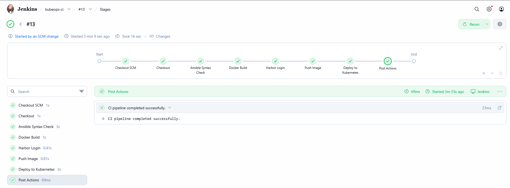
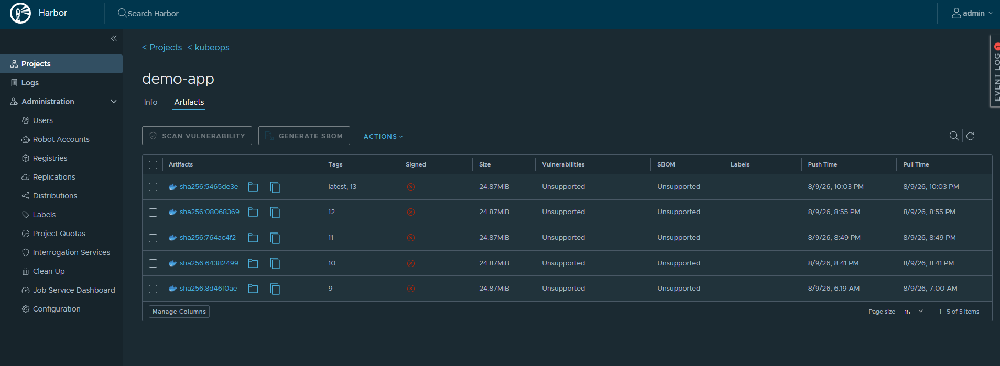
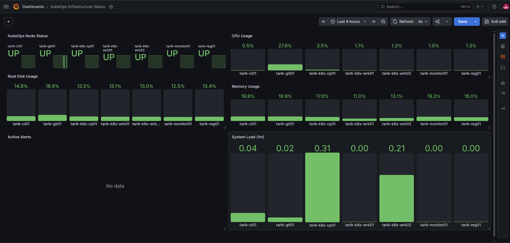
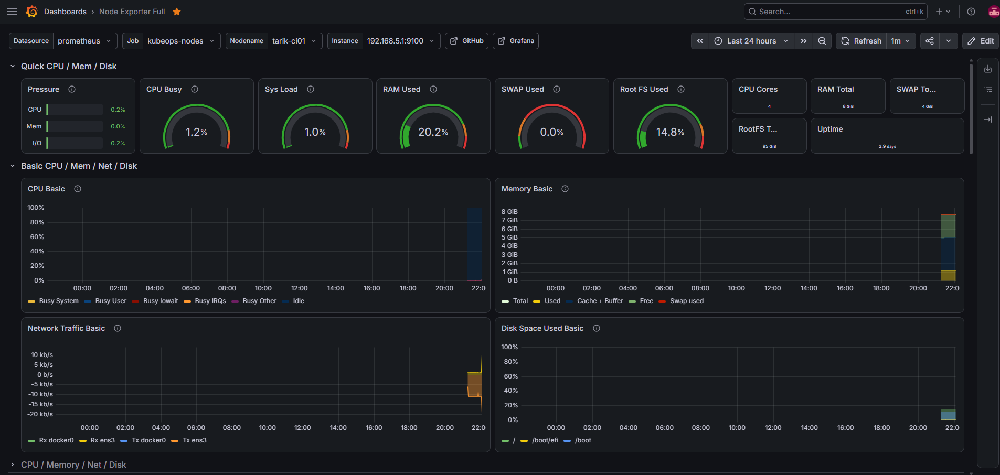
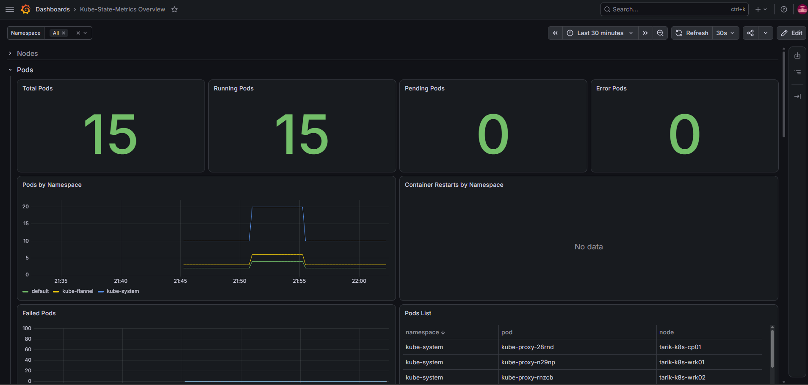
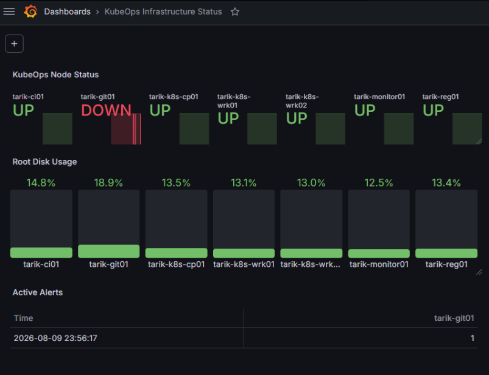

# KubeOps Lab

KubeOps Lab is a hands-on DevOps laboratory environment built on Nutanix AHV.

The project demonstrates infrastructure automation, CI/CD, container image management, Kubernetes deployment, infrastructure monitoring, Kubernetes monitoring, and alerting across a multi-server Linux environment.

## Architecture

| Server | Role |
|---|---|
| `tarik-ops01` | Ansible Control Node |
| `tarik-git01` | Git Service |
| `tarik-ci01` | Jenkins CI/CD Server |
| `tarik-reg01` | Harbor Container Registry |
| `tarik-k8s-cp01` | Kubernetes Control Plane |
| `tarik-k8s-wrk01` | Kubernetes Worker |
| `tarik-k8s-wrk02` | Kubernetes Worker |
| `tarik-monitor01` | Prometheus, Grafana and Alertmanager |

All systems run as virtual machines in a Nutanix AHV lab environment.

## Technology Stack

- Nutanix AHV
- Ubuntu Server
- Git and GitHub
- Ansible
- Jenkins
- Docker
- Harbor
- Kubernetes
- NGINX
- Prometheus
- Grafana
- Node Exporter
- kube-state-metrics
- Alertmanager

## Infrastructure Automation

Ansible is used for configuration management and infrastructure automation.

The control node manages the lab servers over SSH using a centralized inventory.

```text
ansible/
├── inventory
├── ansible.cfg
└── playbooks/
    ├── base-setup.yml
    ├── ci-setup.yml
    ├── registry-setup.yml
    ├── harbor-setup.yml
    ├── kubernetes-setup.yml
    ├── kubernetes-cluster.yml
    ├── kubernetes-harbor.yml
    ├── monitoring-setup.yml
    ├── node-exporter.yml
    ├── prometheus-targets.yml
    ├── alertmanager-setup.yml
    └── prometheus-alerts.yml
```

Automation includes Linux base configuration, package management, Docker installation, Jenkins configuration, Harbor configuration, Kubernetes node preparation, cluster setup, monitoring deployment, Prometheus target configuration, and alerting.

## CI/CD Pipeline

Application deployments are handled through the repository `Jenkinsfile`.

```text
Git Push
   |
   v
GitHub
   |
   v
Jenkins
   |
   +-- Checkout
   |
   +-- Ansible Syntax Check
   |
   +-- Docker Build
   |
   +-- Harbor Authentication
   |
   +-- Push Image
   |
   +-- Kubernetes Deployment
   |
   +-- Rollout Verification
   |
   +-- Deployment Verification
   |
   v
Running Application
```

Each Jenkins build creates a versioned Docker image.

```text
harbor.kubeops.local/kubeops/demo-app:<build-number>
harbor.kubeops.local/kubeops/demo-app:latest
```

The image is pushed to Harbor and the Kubernetes deployment is updated automatically.

### Jenkins Pipeline



## Container Registry

Harbor is used as the private container registry.

Jenkins authenticates using a dedicated Harbor robot account and pushes versioned images generated by the pipeline.

Kubernetes nodes are configured to pull application images from the internal Harbor registry.

### Harbor Registry



## Kubernetes

The Kubernetes cluster consists of one control-plane node and two worker nodes.

```text
             tarik-k8s-cp01
              Control Plane
                    |
          +---------+---------+
          |                   |
          v                   v
 tarik-k8s-wrk01       tarik-k8s-wrk02
      Worker                Worker
```

The demo application runs with two replicas distributed across the worker nodes.

The application is exposed through a NodePort service on port `30080`.

Kubernetes readiness and liveness probes are configured to verify application health.

## Kubernetes RBAC

Jenkins uses a dedicated Kubernetes ServiceAccount:

```text
jenkins-deployer
```

A namespace-scoped Role and RoleBinding provide only the permissions required by the deployment pipeline.

This allows Jenkins to update the application deployment and monitor rollout status without using cluster administrator credentials.

## Deployment Verification

The Jenkins pipeline verifies each deployment after the Kubernetes rollout completes.

The verification stage checks:

- Two `demo-app` pods are running
- Kubernetes rollout completes successfully
- The application responds successfully over HTTP

If verification fails, the Jenkins build is marked as failed.

## Monitoring

Prometheus and Grafana are used for centralized infrastructure and Kubernetes monitoring.

Node Exporter runs on the Linux servers and provides metrics such as:

- CPU utilization
- Memory utilization
- Root disk utilization
- Network metrics
- System load
- Uptime

Prometheus collects these metrics from all monitored lab nodes.

### Infrastructure Dashboard

The custom Grafana infrastructure dashboard provides a single view of:

- Node UP / DOWN status
- CPU usage
- Memory usage
- Root disk usage
- 1-minute system load
- Active alerts



### Node Monitoring

Detailed system metrics can also be viewed using the Node Exporter dashboard.



## Kubernetes Monitoring

`kube-state-metrics` is deployed inside the Kubernetes cluster.

Prometheus collects Kubernetes object-state metrics including:

- Nodes
- Pods
- Deployments
- Namespaces
- ReplicaSets
- StatefulSets
- Jobs
- Persistent Volume Claims

Grafana is used to visualize Kubernetes cluster and workload information.



## Alerting

Prometheus alert rules are used to detect infrastructure and Kubernetes problems.

Implemented rules include:

- `NodeDown`
- `KubernetesPodNotRunning`

Prometheus forwards firing alerts to Alertmanager.

The `NodeDown` rule was tested by stopping Node Exporter on `tarik-git01`. Prometheus detected the target as unavailable, the alert moved from pending to firing, Alertmanager received the alert, and the Grafana infrastructure dashboard displayed both the node failure and active alert.



The alerting flow is:

```text
Node Exporter / kube-state-metrics
              |
              v
          Prometheus
              |
          Alert Rules
              |
              v
         Alertmanager
              |
              v
            Grafana
```

## Demo Application

A lightweight NGINX container is used to validate the end-to-end delivery workflow.

The deployment process is:

```text
Code Change
    |
    v
Git Push
    |
    v
Jenkins
    |
    v
Docker Build
    |
    v
Harbor Registry
    |
    v
Kubernetes
    |
    v
Rolling Update
    |
    v
Deployment Verification
```

## Repository Structure

```text
kubeops-lab/
├── ansible/
│   ├── inventory
│   ├── ansible.cfg
│   └── playbooks/
├── app/
│   ├── Dockerfile
│   └── index.html
├── kubernetes/
│   ├── deployment.yaml
│   └── service.yaml
├── docs/
│   └── images/
├── Jenkinsfile
└── README.md
```
